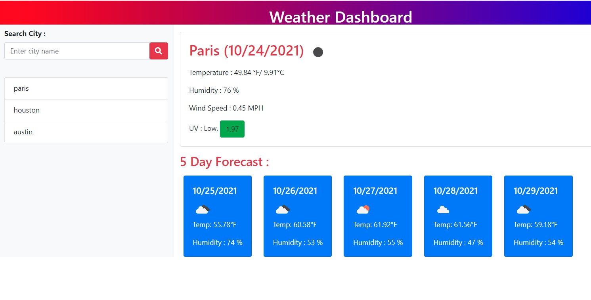

# Weather-Dashboard

This is a weather dashboard that allows you to search a city and get the five day forcast. I built the layout using bootstrap and used javascript and jquery to populate the results. This website pulls information using the OpenWeather API. 

To use website simply search a city name and click the search icon. This website uses localstorage to save previously searched cities.

Project Link:  https://smashercoder.github.io/weather-dashboard/

